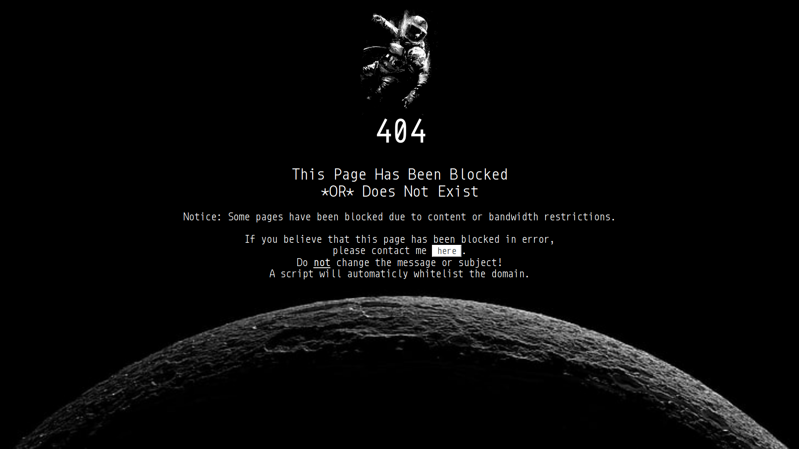

# Pihole-404
A nice custom 404 page for pihole with an added automatic script that can be used to whitelist the domain with the click of a button.\

_^Above: This is what your 404 page will look like! Of course, feel free to customize it._
#### Note: This is an unofficial third-party addon for your pi-hole.
## Table of Contents
*   [The Problem](#the-problem)
*   [The Solution](#the-solution)
*   [Step 1](#step-1-install-pihole-and-get-it-working)
*   [Step 2](#step-2-gmail-users-only-enable-less-secure-app-access-and-imap)
*   [Step 3](#step-3-gmail-users-who-use-2fa-only-add-an-app-password-to-use-instead-of-your-google-account-password)
*   [Step 4](#step-4-set-up-the-repo-and-install)
*   [Known Bugs](#known-issuesbugs)
*   [Uninstalling](#uninstalling)
*   [Credits](#credits)

## The Problem
&emsp; Setting up a Pihole is awesome and pretty easy. But what happens when a page you want to go to is blocked? You get a boring 404 error. And what if you want to go to the webpage? First, you have to go to your pihole's website. Then you have to login. Next, you need to go to whitelist and type in the domain. This is great, but what if you don't know the password or a client has problems?

## The Solution
&emsp; Pihole-404 to the rescue! This simple script will add a button that lets you email the admin. This email will be read by an automatic python script and the domain will be whitelisted! And on top of all that, it makes the 404 page look very nice!\
&emsp; I used Email so it would be more secure, not just a command being executed by the website. Having a button to run any command on the pihole would be a vulnerability, so I decided email would be better.

## Step 1: Install Pihole and Get it Working
To get your pihole up and running (haha), head over to [https://github.com/pi-hole/pi-hole](https://github.com/pi-hole/pi-hole)

## Step 2: (Gmail users only) Enable Less Secure App Access and IMAP
If you are using an email provider other than Gmail, skip to [step 4](#step-4-set-up-the-repo-and-install).\
If you are using Gmail, you need to enable less secure app access to your google account [here](https://myaccount.google.com/lesssecureapps). You also need to enable IMAP, if it is not already enabled [here](https://mail.google.com/mail/u/0/#settings/fwdandpop). Scroll down to **IMAP Access** and make sure **Status** is set to **Enable IMAP**. I am not sure about other providers as I have not tried them.

## Step 3: (Gmail users who use 2FA only) Add an App Password to Use Instead of your Google Account Password
If using Gmail and you have 2 Facter Authentication setup, do these steps. Otherwise, skip to [step 4](#step-4-set-up-the-repo-and-install)
1.  Go to https://myaccount.google.com/
2.  On the left side, select 'Security'
3.  Scroll down to the 'Signing in to Google' section and select 'App Passwords'
4.  You will be asked to sign in. Sign in.
5.  Once you have signed in again, press the menu 'Select an App' and then press 'Other'. Make the name something memorable such as 'Pihole'.
6.  Click 'GENERATE'. Copy the 16 character password for later.

## Step 4: Set up the Repo and Install
On the Raspberry Pi, Clone this repository:
### `git clone https://github.com/pythoncoder8888/Pihole-404.git`
Navigate to the project folder:
### `cd Pihole-404`
or wherever the repo folder was installed if you installed it in a different location.\
Run the installer script (as root):
### `sudo python3 install.py`
When you are asked for a password, enter your email password. If you use Google/Gmail and have 2 Facter Authentication set up, paste the app password from earlier here using `Ctrl + Shift + V`\
Test the script here: http://doubleclick.net \
You should get a 404 page like the screenshot above.

## Known Issues/Bugs
&emsp; The script only works for http websites, not https/tls 😢.\
&emsp; When using SSH to access the Raspberry Pi, the email checker program may be stopped when exitting SSH.\
If this happens, just log on to the Raspberry Pi through HDMI and a keyboard.\
Then go to the folder you cloned this repo in using `cd` Type:
### `watch -n 10 python3 EmailChecker.py &`
This will start the program in the background.\
Any time you shutdown or restart, you also must run this command.\
If the Raspberry Pi updates, you will need to run the installer script again. The program now edits /etc/lighttpd/external.conf to preserve changes.\
The installer script should fix this.
### _Note: This script sets blocking mode to IP blocking. If you want to change this, just edit /etc/pihole/pihole-FTL.conf and set blocking mode to something else (anything other than IP will disable the 404 page). This is explained in depth [here](https://docs.pi-hole.net/ftldns/blockingmode/)_

## Uninstalling
Sorry to see you go. If you want to uninstall the programs and restore settings before the script was used, just use the following command:
### `sudo sh uninstall.sh`
Please email me at [bennypythoncoder@gmail.com](mailto:bennypythoncoder@gmail.com?subject=Why%20I%20uninstalled%20Pihole-404) to tell me why you chose to uninstall the programs.

## Credits
*   Everyone at [pi-hole](https://pi-hole.net) ([Github](https://github.com/pi-hole/pi-hole))
*   [This](https://www.reddit.com/r/pihole/comments/a9v7jj/how_to_install_a_custom_block_page_for_websites/) Reddit post which was incredibly useful
*   _imap-tools_ python package, found [here at pypi](https://pypi.org/project/imap-tools/), used for processing emails
*   [Python3](https://python.org), a phonomenal programming language everyone should know
*   [The Raspberry Pi Foundation](https://raspberrypi.org) for making awesome little computers
*   Wallpaperflare for amazing images ([Astronaut](https://www.wallpaperflare.com/astronaut-clipart-space-monochrome-artwork-copy-space-close-up-wallpaper-ppoyl), [Moon](https://www.wallpaperflare.com/minimalism-space-black-background-artwork-simple-background-wallpaper-pmmgi))
*   [Pixlr E](https://pixlr.com/e/) for great online photo editing

## If you find this repo useful, **please ⭐ it and share it!** If you have questions, just create an [issue](https://github.com/BennyThePythonCoder/Pihole-404/issues)
